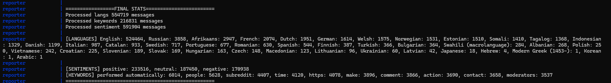

# Data Streaming Homework - Project A. E2E data processing pipeline - processing social media data (reddit)
Goals:
- Learn about implementation of E2E data processing pipelines using kafka for processing social media data (reddit)  

## Reddit Dataset

As dataset was used [1 million Reddit comments from 40 subreddits](https://www.kaggle.com/datasets/smagnan/1-million-reddit-comments-from-40-subreddits), from which the last two columns were removed by running the command `cut -d, -f1-2 kaggle_RC_2019-05.csv > reddit_ds.csv`.

And thus, the working dataset `reddit_ds.csv` contains the following columns:
- `subreddit (categorical)`: on which subreddit the comment was posted
- `body (str)`: comment content

## How to Run the Implementation

### Usage notes

Set up and run
```
git clone https://github.com/conduktor/kafka-stack-docker-compose.git
cd kafka-stack-docker-compose
docker compose -f full-stack.yml up -d
cd ..
git clone https://github.com/artemiuss/kafka_throughput_investigation.git
cd kafka_throughput_investigation
docker compose build
docker compose up
```

Stop and clean-up
```
docker compose down --rmi all -v --remove-orphans
cd kafka-stack-docker-compose
docker compose -f full-stack.yml down --rmi all -v --remove-orphans
```

## Statistics



- List of languages with numbers of messages
- Number of messages among sentiment classes 
- Top 10 keywords


